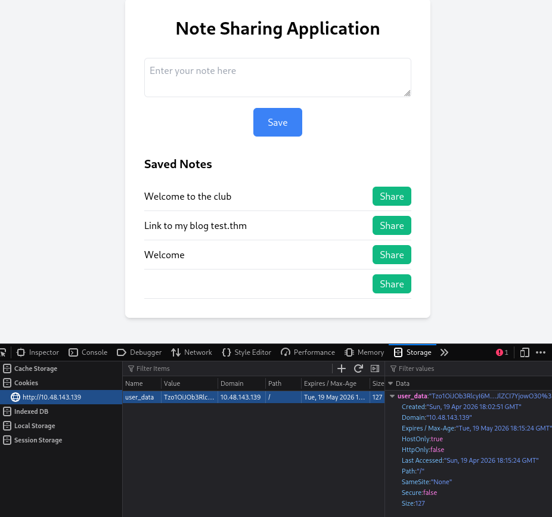
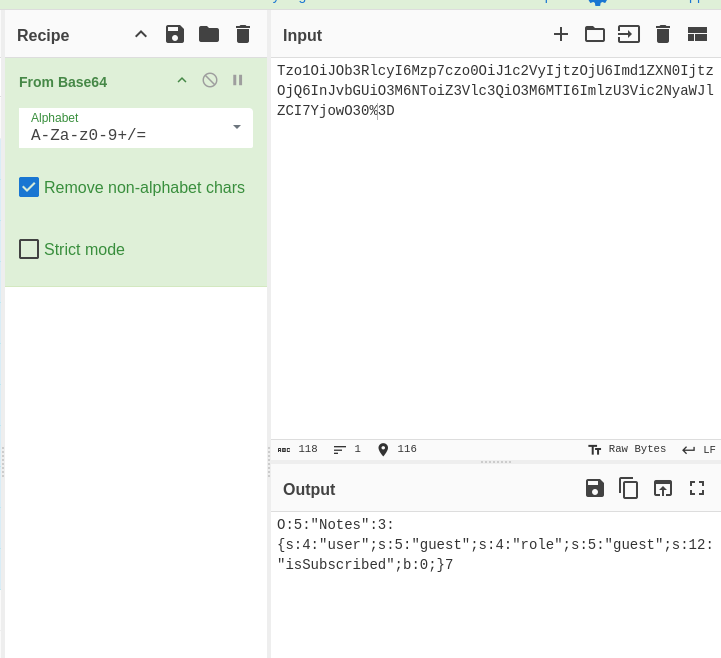
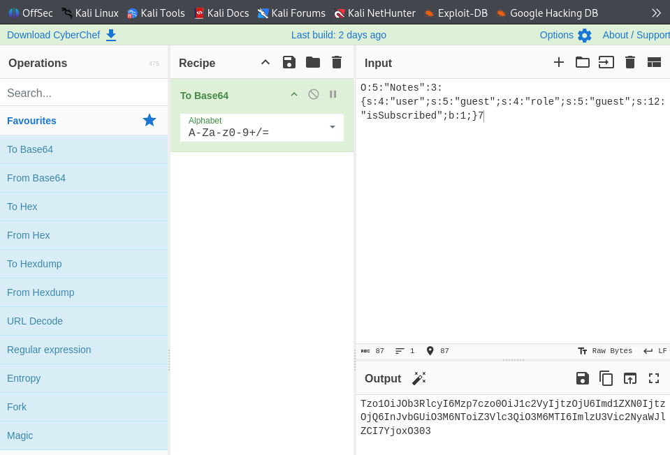
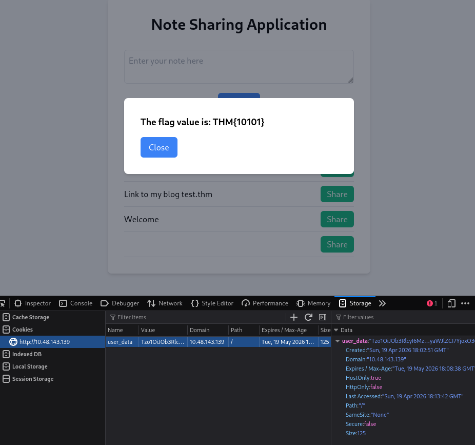

# SWS304: CyberSecurity — Software Engineering

## Lab 05: Insecure Deserialization

**Submitted by:** Dechen Wangdra Sherpa  
**Student No:** 02230281  
**Royal University of Bhutan, College of Science and Technology**

---

## Table of Contents

- [1. Objective](#1-objective)
- [2. Tools and Environment](#2-tools-and-environment)
- [3. Questions](#3-questions)
  - [Question 1](#question-1)
  - [Question 2](#question-2)
  - [Question 3](#question-3)
  - [Question 4](#question-4)
  - [Question 5](#question-5)
  - [Question 6](#question-6)
  - [Question 7](#question-7)
  - [Question 8](#question-8)
  - [Question 9](#question-9)
  - [Question 10](#question-10)
- [4. Conclusion](#4-conclusion)

---

## 1. Objective

The objective of this lab is to understand the concept of insecure deserialization vulnerabilities, how serialized objects are structured in PHP, and how an attacker can tamper with serialized data to escalate privileges or achieve remote code execution (RCE).

---

## 2. Tools and Environment

- TryHackMe lab machine
- Kali Linux with VPN as Attacker machine
- Web browser with Developer Tools

---

## 3. Questions

### Question 1

In PHP, what is the specific function used to convert an object into a storable byte stream?

**ANS =>** `serialize()` is the specific function used to convert an object into a storable byte stream.

---

### Question 2

When looking at the serialized note `a:2:{s:5:"title";s:12:"My THM Note";...}`, what does the `a:2` at the beginning signify?

**ANS =>** An array containing 2 elements.

---

### Question 3

Which PHP magic method is automatically invoked the moment an object is reconstructed from a string?

**ANS =>** `__wakeup()` is the PHP magic method automatically invoked.

---

### Question 4

You are auditing a site and notice a cookie value that starts with `TzoxMzo....` After Base64 decoding, you see it starts with `O:8:"`. What programming language is likely being used for serialization here?

**ANS =>** PHP

---

### Question 5

What common file extension suffix do attackers add to the end of a PHP filename (e.g., `index.php~`) to look for leaked source code backups?

**ANS =>** ~ (tilde)

---

### Question 6

Access `http://MACHINE_IP/case1`. Decode the cookie provided by the site. What is the exact length of the user string value in the serialized object?

**ANS =>** 5

---

### Question 7

After modifying the cookie to set `isSubscribed` to `true` and refreshing the page, what is the "Flag" or "Success Message" displayed on the screen?

**ANS =>** `THM{10101}`

---

### Question 8

In the provided `test.php` file, which class contains the malicious `exec()` call within the `__wakeup` method?

**ANS =>** `MaliciousUserData`

---

### Question 9

When generating your payload to get a reverse shell, you must Base64 encode the result. What are the first 10 characters of the Base64 string generated for the `MaliciousUserData` object?

**ANS =>** `TzoxNjoi`

---

### Question 10

Establish a Netcat listener and trigger the exploit. Once you have a shell, what is the content of the file `/var/www/flag.txt`?

**ANS =>** `THM{in53cur3_d3s3r14l1z4t10n}`

---

## 4. Conclusion

This lab demonstrated how insecure deserialization vulnerabilities arise when an application accepts untrusted serialized data and reconstructs objects from it without validation. From this lab, I learned the fundamentals of PHP serialization, including the `serialize()` function, the structure of serialized output, and the role of magic methods.

### Key Takeaways

- Never trust serialized data coming from the client.
- Avoid using `unserialize()` on user-controlled input; prefer safe formats such as JSON with strict schema validation.
- Defence in depth: sign or encrypt serialized data, keep backups off the web root, and monitor for suspicious outbound connections that may indicate reverse shells.
